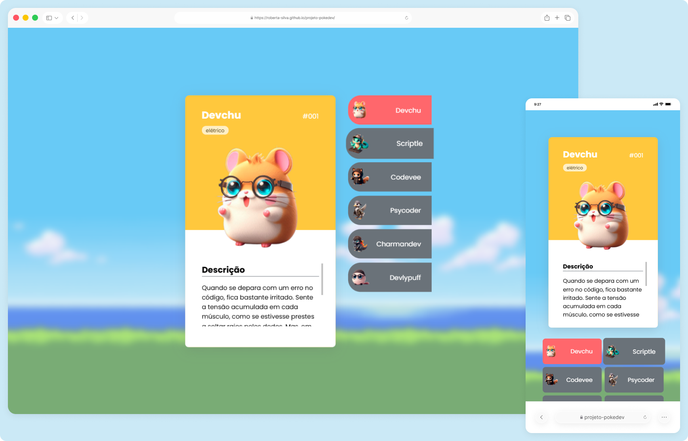

# Pokedevs ✨
Projeto desenvolvido com fins educacionais durante um workshop introdutório de desenvolvimento web.  
O Pokedevs representa meu primeiro contato prático com a criação de páginas web e com a manipulação de elementos na interface, marcando o início da minha jornada como desenvolvedora.

> Status do projeto: Concluído ✔️

## Acesse o projeto
🔗 [https://roberta-silva.github.io/projeto-pokedev/](https://roberta-silva.github.io/projeto-pokedev/)

## Funcionalidades
- Exibição de personagens no layout
- Interação visual com elementos da interface
- Atualização de conteúdo com base em ações do usuário

## Objetivos técnicos
- Primeira experiência prática com HTML, CSS e JavaScript
- Estruturação básica de páginas web
- Manipulação de elementos da interface com JavaScript
- Compreensão inicial do funcionamento do DOM

## Tecnologias
- HTML5
- CSS3
- JavaScript

## 👀 Preview

